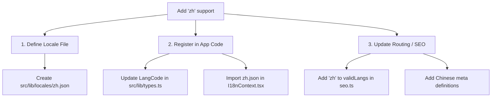

# Chinese Localization & Implementation Plan (zh)

This document provides a comprehensive roadmap for extending the VARS Aquaculture Portal to support **Simplified Chinese (`zh`)**, targeting Chinese commercial hatcheries, RAS producers, and import managers.

---

## 1. Technical Framework Changes

To add Chinese support, developers need to implement the following changes:



### Step 1: Locale Dictionary File

Create [src/lib/locales/zh.json](file:///home/rubuntu/Projects/Websites/aqua-bloom-portal/src/lib/locales/zh.json) mirroring all translation keys from `en.json`.

### Step 2: Code Configurations

- **`src/lib/types.ts`:**
  Update `LangCode` union type:
  ```typescript
  export type LangCode = "en" | "tr" | "ar" | "de" | "ru" | "ja" | "ko" | "zh";
  ```
- **`src/context/I18nContext.tsx`:**
  - Import `zh.json`.
  - Add `"zh"` to `validLangs`.
  - Update translation record map:
    ```typescript
    const translations: Record<LangCode, Record<string, string>> = {
      en,
      tr,
      ar,
      de,
      ru,
      ja,
      ko,
      zh,
    };
    ```

### Step 3: SEO & SSR Routing

- **`src/lib/utils/seo.ts`:**
  - Add `"zh"` to `validLangs` list.
  - Add Chinese title and description blocks for B2B search terms.

---

## 2. Aquaculture Terminology Mapping

When translating pages and articles, the Chinese translation editor agent will use the following standard B2B aquaculture nomenclature:

| English Term                   | Chinese Standard    | Pinyin                               | Notes                                                                    |
| :----------------------------- | :------------------ | :----------------------------------- | :----------------------------------------------------------------------- |
| **Eyed Eggs / Eyed Ova**       | 发眼卵              | fā yǎn luǎn                          | Professional hatchery term (do not translate literally as "有眼睛的卵"). |
| **Live Feed**                  | 鲜活饵料 / 活体饲料 | xiān huó ěr liào / huó tǐ sì liào    | Standard industrial term for larvae feed.                                |
| **Artemia Cysts**              | 丰年虫卵 / 卤虫卵   | fēng nián chóng luǎn / lǔ chóng luǎn | Both are widely accepted. "丰年虫" is more common in commercial feed.    |
| **Rotifers**                   | 轮虫                | lún chóng                            | General term for Brachionus culture.                                     |
| **Chlorella**                  | 小球藻              | xiǎo qiú zǎo                         | Used for green water systems.                                            |
| **Hatchery**                   | 孵化场 / 育苗场     | fū huà cháng / yù miáo cháng         | Hatchery / nursery facility.                                             |
| **Biosecurity**                | 生物安全            | shēng wù ān quán                     | Critical for pathogen-free eggs.                                         |
| **Broodstock**                 | 亲鱼                | qīn yú                               | Parent breeder stock.                                                    |
| **RAS (Recirculating System)** | 循环水养殖系统      | xún huán shuǐ yǎng zhí xì tǒng       | Land-based closed farming systems.                                       |

---

## 3. Translation Editor Agent Prompt (`zh`)

When configuring a subagent task for the Chinese locale:

```json
{
  "TypeName": "translation_editor",
  "Role": "Chinese B2B Aquaculture Editor",
  "Prompt": "Translate/Audit src/lib/locales/zh.json. Ensure formal business Chinese (using terms like 发眼卵, 鲜活饵料, 丰年虫卵). Keep placeholders like {count} and {brand} intact."
}
```

---

## 4. Developer UI Layout Checkpoints for Chinese (`zh`)

Chinese characters possess distinct typographic behaviors. Developers must inspect these items post-implementation:

1. **Font Styling:**
   Apply standard sans-serif system font stacks for Chinese to prevent fallback serifs:
   ```css
   font-family:
     -apple-system, BlinkMacSystemFont, "Segoe UI", Roboto, "Helvetica Neue", "PingFang SC",
     "Microsoft YaHei", "Noto Sans CJK SC", sans-serif;
   ```
2. **Text Density:**
   Chinese translations are typically **40-50% shorter** than English sentences. Make sure the visual spacing and margins do not look overly empty or sparse, and maintain grid proportioning.
3. **Word Wrapping:**
   Chinese text does not have word spaces. CSS line breaks occur at any character. To prevent single characters wrapping onto a new line in headings, use CSS rules like:
   ```css
   word-break: keep-all;
   overflow-wrap: break-word;
   ```
4. **Number Formatting:**
   In Chinese business, larger numbers are grouped by **ten-thousand (万 - wàn)** rather than thousands. Check that big statistics (like shipping numbers or production capacities) render logically.
