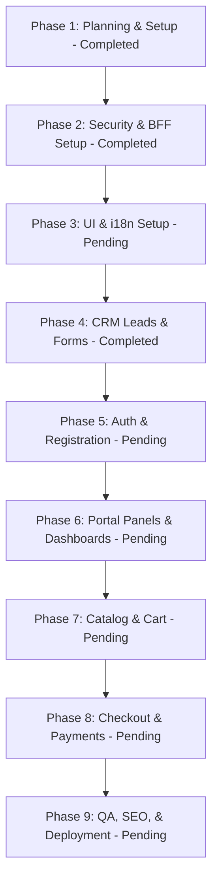

# Aqua Bloom Portal - Implementation Plan & SDLC Guide

This plan defines the step-by-step Software Development Lifecycle (SDLC) to build the headless Aqua Bloom Portal, integrating it safely with Odoo 19.

---

## 1. SDLC Phases

### Phase 1: Planning & Setup — **Completed**

- Initialize the target directory structures and establish Git workflows. (Completed 2026-07-20)
- Verify tool installations (`pnpm`/`bun` and runtime servers). (Completed 2026-07-20)
- Establish the mock JSON api dataset inside `src/lib/` to facilitate development prior to Odoo API integration. (Completed 2026-07-20)

### Phase 2: Security & BFF Setup — **Completed**

- Implement TanStack Start server functions/endpoints to act as the Backend-For-Frontend (BFF). (Completed 2026-07-20)
- Secure API credential storage using environment variables (never committed to repository). (Completed 2026-07-20)
- Wire the CORS configurations, CSRF tokens, and rate-limiting modules on public endpoints. (Completed 2026-07-20)

### Phase 3: UI & i18n Setup — _Pending_

- Initialize Tailwind CSS v4 design tokens matching the corporate branding guidelines (e.g. Navy, Soft Cream, Accent Gold).
- Build structural shell elements: `<Header />`, `<Footer />`, `<Navigation />` layout files in `src/components/`.
- Configure TanStack Start localization context, implementing routing parameters for multi-language paths (e.g. `/[locale]/about-us`).

### Phase 4: CRM Leads & Forms — **Completed**

- Implement Zod schemas for request input validation on the contact and quote forms. (Completed 2026-07-20)
- Build the `/request-quote` and `/contactus` UI pages. (Completed 2026-07-20)
- Connect the forms to the Astro/Start server functions, dispatching clean payloads to Odoo's CRM API write endpoint. (Completed 2026-07-20)

### Phase 5: Auth & Registration Flow — _Pending_

- Implement `/login` and `/register` route endpoints.
- Write session mapping logic inside Start server functions to proxy email/password to Odoo, capture Odoo's session cookie, and set it as an HTTP-only cookie on the customer domain.
- Write auth hooks (`useAuth`) to manage client-side state, redirection boundaries, and token renewals.

### Phase 6: Portal Panels & Dashboards — _Pending_

- Construct the portal navigation wrap inside `src/routes/account.tsx`.
- Build user panels for `/account/profile` (address manager), `/account/orders` (history grid), and `/account/customs` (customs logistics documents).
- Implement server-side loaders in TanStack Start to fetch corresponding data from Odoo portal routes using the proxied user session.

### Phase 7: Catalog & Cart Integration — _Pending_

- Render product listing grid (`/products`) and item detail pages (`/products/$category/$slug`) using TanStack routing.
- Implement the shopping cart state (`CartContext`) using browser storage (`localStorage`).
- Wire real-time dynamic pricing lookups on product detail pages to support customer-tier price list checks.

### Phase 8: Checkout & Payments — _Pending_

- Create the checkout form interface at `/cart`.
- Implement the checkout server function to submit cart arrays to Odoo and generate a draft Sales Order (`sale.order`).
- Wire third-party payment gateway SDKs/iframe sessions (e.g., Stripe, Iyzico) and configure secure payment confirmation webhooks on Odoo.

### Phase 9: QA, SEO, & Deployment — _Pending_

- Execute automated test runs (Unit, Integration, and E2E checks).
- Run lighthouse performance scans, ensuring all Core Web Vitals targets are satisfied.
- Audit SEO alternates, canonical anchors, sitemap indices, and robots.txt.
- Deploy to staging, verify the complete user journey, then execute cutover.

---

## 2. Agent Guidelines & Coding Best Practices

To ensure subsequent AI coding agents can work on this codebase seamlessly:

1. **No Odoo Code Development**: Do not write Python/Odoo module files inside this repository. If Odoo-side changes are required, log the requirements inside `doc/odoo_api_spec.md`. The reference addon `varsco_content_api` inside `/home/rubuntu/Projects/varsco_front` should be leveraged.
2. **Strict Interfaces**: Define data models and API payload shapes as clean TypeScript interfaces inside `src/lib/types.ts`.
3. **Fail Loudly**: Reject invalid payloads at API boundaries with detailed error statuses.
4. **Islands on Interactivity**: Use server rendering by default. Hydrate client-side React components (using `use client` directives) ONLY for interactive panels like dynamic charts, input forms, or carts.
5. **No committed secrets**: Always fetch API keys, endpoint URLs, and tokens from `process.env`.
